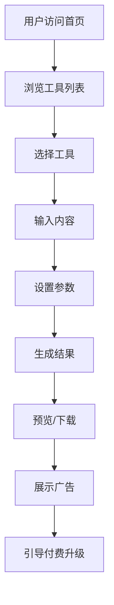

## 1. Product Overview
一个多功能在线工具网站，聚合实用工具帮助用户完成日常任务，通过广告展示和付费增值服务实现盈利。
- 核心功能：提供在线工具（二维码生成、图片压缩、文本处理等）
- 目标用户：普通网民、办公人士、开发者
- 商业价值：通过广告联盟和付费高级功能实现收入

## 2. Core Features

### 2.1 User Roles
| Role | Registration Method | Core Permissions |
|------|---------------------|------------------|
| 普通用户 | 无需注册 | 使用基础工具功能 |
| 付费用户 | 在线支付 | 使用高级功能、无广告 |

### 2.2 Feature Module
1. **首页**: 工具导航、热门工具展示、广告位
2. **二维码工具**: 生成多种样式二维码
3. **图片工具**: 图片压缩、格式转换
4. **文本工具**: 字数统计、大小写转换、文本加密
5. **开发者工具**: JSON格式化、Base64编解码

### 2.3 Page Details
| Page Name | Module Name | Feature description |
|-----------|-------------|---------------------|
| 首页 | Hero区域 | 工具分类展示、快速搜索 |
| 首页 | 工具列表 | 卡片式工具展示，点击跳转 |
| 首页 | 广告区域 | 顶部和侧边广告展示 |
| 二维码工具 | 输入区域 | 支持文本、网址输入 |
| 二维码工具 | 样式设置 | 颜色、尺寸、Logo自定义 |
| 二维码工具 | 预览下载 | 实时预览和多格式下载 |
| 图片工具 | 上传区域 | 支持拖拽上传 |
| 图片工具 | 压缩设置 | 质量调整、格式选择 |
| 图片工具 | 结果展示 | 压缩前后对比 |
| 文本工具 | 输入区域 | 大文本框输入 |
| 文本工具 | 功能按钮 | 多种文本处理功能 |
| 开发者工具 | 代码输入 | 支持语法高亮 |
| 开发者工具 | 格式化 | JSON、XML、Base64处理 |

## 3. Core Process
用户访问首页 → 选择工具 → 使用工具处理内容 → 预览/下载结果 → 展示广告或引导付费

## 4. User Interface Design

### 4.1 Design Style
- 主色调：科技蓝 (#3B82F6) + 深灰背景 (#1F2937)
- 按钮风格：圆角矩形，渐变色填充
- 字体：Inter + JetBrains Mono（代码区域）
- 布局：卡片式网格布局
- 图标：Lucide Icons

### 4.2 Page Design Overview
| Page Name | Module Name | UI Elements |
|-----------|-------------|-------------|
| 首页 | Hero区域 | 渐变背景、大标题、搜索框、工具分类标签 |
| 首页 | 工具列表 | 卡片式设计、图标+名称+描述、hover动效 |
| 首页 | 广告区域 | 顶部横幅广告、侧边固定广告位 |
| 工具页面 | 输入区域 | 大尺寸输入框、拖拽上传支持 |
| 工具页面 | 设置面板 | 侧边栏参数设置、实时预览 |
| 工具页面 | 结果区域 | 结果展示、下载按钮、分享按钮 |

### 4.3 Responsiveness
- 桌面端：1200px+，三列工具卡片
- 平板端：768px-1199px，两列工具卡片
- 移动端：<768px，单列工具卡片，底部导航

### 4.4 3D Scene Guidance
不适用，本项目为2D工具网站。