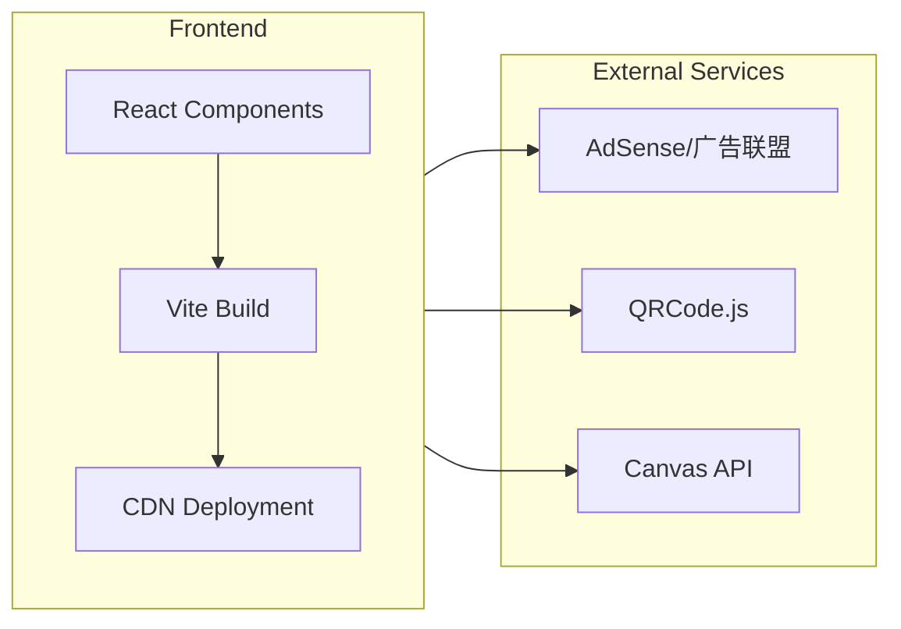

## 1. Architecture Design



## 2. Technology Description

* Frontend: React\@18 + tailwindcss\@3 + vite

* Initialization Tool: vite-init

* Backend: None（纯前端项目，无需后端）

* Database: None（无需数据库）

* Third-party Libraries: qrcode.react, lucide-react

## 3. Route Definitions

| Route        | Purpose   |
| ------------ | --------- |
| /            | 首页，工具列表展示 |
| /qr-code     | 二维码生成工具   |
| /image-tools | 图片处理工具    |
| /text-tools  | 文本处理工具    |
| /dev-tools   | 开发者工具     |

## 4. API Definitions

无需后端API，所有功能在前端完成。

## 5. Server Architecture Diagram

不适用，本项目为纯前端项目。

## 6. Data Model

不适用，本项目无需数据库。

## 7. Project Structure

```
src/
├── components/
│   ├── Header.tsx          # 顶部导航
│   ├── ToolCard.tsx        # 工具卡片
│   ├── HeroSection.tsx     # Hero区域
│   ├── AdBanner.tsx        # 广告横幅
│   └── Footer.tsx          # 页脚
├── pages/
│   ├── Home.tsx            # 首页
│   ├── QrCodeTool.tsx      # 二维码工具
│   ├── ImageTools.tsx      # 图片工具
│   ├── TextTools.tsx       # 文本工具
│   └── DevTools.tsx        # 开发者工具
├── utils/
│   ├── qrCode.ts           # 二维码生成
│   ├── imageCompressor.ts  # 图片压缩
│   └── textUtils.ts        # 文本处理
├── App.tsx                 # 主应用
├── main.tsx                # 入口文件
└── index.css               # 全局样式
```

