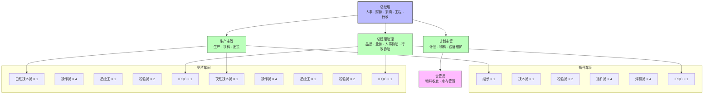

# 珠海博瑞通电子科技有限公司

# 组织架构与职责分工

|      文件编号     |  版本 |     生效日期    |    页码   |
| :-----------: | :-: | :---------: | :-----: |
| BRT-GL-ZD-001 | A/0 | 2026年07月03日 | 第1页 共1页 |

***

## 一、目的

为明确公司组织架构、部门职能及岗位职责，建立权责清晰、协作顺畅的管理体系，保障公司战略目标的有效落地，特制定本制度。

## 二、适用范围

本制度适用于珠海博瑞通电子科技有限公司全体员工及各职能模块。

## 三、组织架构原则

### 3.1 扁平化管理原则

本公司采用**扁平化管理**模式，仅设立一个正式部门——**综合办**。所有职能模块（业务、计划、采购、仓库、工程、生产、品质、行政、人事、财务）直接在综合办下运行，简化层级，提高决策效率。

### 3.2 权责清晰原则

每项工作明确唯一负责人，避免多头指挥和责任真空，确保"一件事只有一个负责人"。

### 3.3 协作顺畅原则

明确各模块间的协作关系和流程节点，减少推诿扯皮，强化团队协同。

### 3.4 战略导向原则

组织架构与职能设置始终围绕公司战略目标，支撑业务发展和绩效提升。

***

## 四、组织架构图

***

## 五、汇报关系

### 5.1 管理岗位汇报关系

|  序号 |  姓名 |   岗位  | 直接上级 |
| :-: | :-: | :---: | :--: |
|  1  |  何银 |  总经理  |  股东  |
|  2  | 史业成 | 总经理助理 |  总经理 |
|  3  | 许良祥 |  生产主管 |  总经理 |
|  4  | 梁金勇 |  计划主管 |  总经理 |
|  5  | 何正楚 |  仓管员  | 计划主管 |

### 5.2 贴片车间岗位汇报关系

|  序号 |      岗位     |     人数     |    直接上级    |
| :-: | :---------: | :--------: | :--------: |
|  1  | 技术员（负责人/带班） |  2（白班+夜班）  |    生产主管    |
|  2  |     操作员     | 8（白班4+夜班4） |   技术员（当班）  |
|  3  |     星级工     |  2（白班+夜班）  |   技术员（当班）  |
|  4  |     检验员     | 4（白班2+夜班2） |   技术员（当班）  |
|  5  |     IPQC    |  2（白班+夜班）  | 总经理助理（品质部） |

***

## 六、职能模块划分

|  序号 | 职能模块 |   负责人   |          成员          | 核心职能                   |
| :-: | :--: | :-----: | :------------------: | :--------------------- |
|  1  |  综合办 | 何银（总经理） |         全体5人         | 统一管理所有事务               |
|  2  |  业务  |   史业成   |          史业成         | 客户对接、报价跟进、订单跟催         |
|  3  |  计划  |   梁金勇   |          梁金勇         | 订单录入、生产计划、物料计划         |
|  4  |  采购  |    何银   |          何银          | 供应商选择、价格审批、采购下单        |
|  5  |  仓库  |   何正楚   |          何正楚         | 物料收发、库存管理、出入库          |
|  6  |  工程  |    何银   |        梁金勇（协助）       | 工艺技术、设备维护、治具管理         |
|  7  |  生产  |   许良祥   |          许良祥         | 车间管理、生产安排、客供料取退、产品出货   |
|  8  |  品质  |   史业成   | 史业成、IPQC×3、IQC兼OQC×1 | IQC/IPQC/OQC、质量体系、客诉处理 |
|  9  |  行政  |    何银   |        史业成（协助）       | 制度执行、考勤、办公事务、5S        |
|  10 |  人事  |    何银   |        史业成（协助）       | 招聘、入职、培训、绩效、薪资决策       |
|  11 |  财务  |    何银   |          何银          | 资金管理、付款审批、成本管控、账务处理    |

***

## 七、车间人员配置

### 7.1 贴片车间（2班制）

#### 白班

|  序号 |    岗位    |  人数 | 所属模块 | 职责说明              |
| :-: | :------: | :-: | :--: | :---------------- |
|  1  | 技术员（负责人） |  1  |  生产  | 设备调试、工艺指导、班次负责、带班 |
|  2  |    操作员   |  4  |  生产  | 贴片操作              |
|  3  |    星级工   |  1  |  生产  | 技能骨干              |
|  4  |    检验员   |  2  |  生产  | 自检、互检             |
|  5  |   IPQC   |  1  |  品质  | 品质部派驻             |

#### 夜班

|  序号 |    岗位    |  人数 | 所属模块 | 职责说明              |
| :-: | :------: | :-: | :--: | :---------------- |
|  1  | 技术员（负责人） |  1  |  生产  | 设备调试、工艺指导、班次负责、带班 |
|  2  |    操作员   |  4  |  生产  | 贴片操作              |
|  3  |    星级工   |  1  |  生产  | 技能骨干              |
|  4  |    检验员   |  2  |  生产  | 自检、互检             |
|  5  |   IPQC   |  1  |  品质  | 品质部派驻             |

### 7.2 插件车间

|  序号 |    岗位   |  人数 | 所属模块 | 职责说明           |
| :-: | :-----: | :-: | :--: | :------------- |
|  1  | 组长（负责人） |  1  |  生产  | 班次负责、人员管理、生产安排 |
|  2  |   技术员   |  1  |  生产  | 设备调试、工艺指导      |
|  3  |   检验员   |  2  |  生产  | 自检、互检          |
|  4  |   插件员   |  4  |  生产  | 插件作业           |
|  5  |   焊锡员   |  4  |  生产  | 焊锡作业           |
|  6  |   IPQC  |  1  |  品质  | 品质部派驻          |

### 7.3 品质模块人员配置

|   序号   |    岗位   |   人数  | 所属模块 | 职责说明                           |
| :----: | :-----: | :---: | :--: | :----------------------------- |
|    1   |   IPQC  |   3   |  品质  | 过程检验（2人派驻贴片车间白班/夜班，1人派驻插件车间）   |
|    2   | IQC兼OQC |   1   |  品质  | 来料检验（IQC）+ 出货检验（OQC），在品质模块日常办公 |
| **合计** |    —    | **4** |   —  | —                              |

### 7.4 车间人员合计

#### 贴片车间（2班制）

|     模块     |   白班  |   夜班  |   总计   |
| :--------: | :---: | :---: | :----: |
|    生产人员    |   8   |   8   |   16   |
| 品质人员（IPQC） |   1   |   1   |    2   |
|   **合计**   | **9** | **9** | **18** |

#### 插件车间

|     模块     |   人数   | 明细                              |
| :--------: | :----: | :------------------------------ |
|    生产人员    |   12   | 组长1 + 技术员1 + 检验员2 + 插件员4 + 焊锡员4 |
| 品质人员（IPQC） |    1   | 品质部派驻                           |
|   **合计**   | **13** | —                               |

> **说明**：
>
> 1. 贴片车间技术员为各班次负责人，负责当班的设备调试、工艺指导和人员管理。
> 2. 插件车间组长为负责人，负责班次管理、生产安排和人员调度。
> 3. 品质模块3名IPQC分配：2名派驻贴片车间（白班/夜班各1名），1名派驻插件车间。
> 4. 1名IQC兼OQC在品质模块日常办公，负责来料检验与出货检验。

***

## 八、岗位说明书

### 8.1 总经理

|    项目    | 内容                                                                        |
| :------: | :------------------------------------------------------------------------ |
| **岗位名称** | 总经理                                                                       |
| **所属模块** | 综合办                                                                       |
| **直接上级** | 股东                                                                        |
| **下属人数** | 4人                                                                        |
| **岗位目标** | 全面负责公司经营管理，实现战略目标与经营指标                                                    |
| **核心职责** | 1. 经营决策与战略规划2. 人事管理与薪资审批3. 财务管理与资金管控4. 采购决策与供应商管理5. 技术指导与工艺审批6. 行政管理与制度审批 |

### 8.2 总经理助理

|    项目    | 内容                                                                                                        |
| :------: | :-------------------------------------------------------------------------------------------------------- |
| **岗位名称** | 总经理助理                                                                                                     |
| **所属模块** | 综合办                                                                                                       |
| **直接上级** | 总经理                                                                                                       |
| **下属人数** | 4人（品质模块：IPQC×3、IQC兼OQC×1）                                                                                 |
| **岗位目标** | 协助总经理开展品质、业务、人事及行政工作，保障公司运营顺畅                                                                             |
| **核心职责** | 1. 品质管理（IQC/IPQC/OQC、质量体系、客诉处理）2. 业务管理（客户对接、订单录入、报价跟进）3. 人事协助（入职手续、培训组织、员工关系）4. 行政协助（制度执行、考勤管理、办公事务、5S推动） |

### 8.3 生产主管

|    项目    | 内容                                              |
| :------: | :---------------------------------------------- |
| **岗位名称** | 生产主管                                            |
| **所属模块** | 综合办                                             |
| **直接上级** | 总经理                                             |
| **下属人数** | 31人（贴片车间18人 + 插件车间13人）                          |
| **岗位目标** | 负责生产计划执行、车间管理及产品交付，确保生产效率与质量                    |
| **核心职责** | 1. 生产安排与工艺执行2. 领料管理与出货管理3. 车间管理与人员调度（贴片车间+插件车间） |

### 8.4 计划主管

|    项目    | 内容                                       |
| :------: | :--------------------------------------- |
| **岗位名称** | 计划主管                                     |
| **所属模块** | 综合办                                      |
| **直接上级** | 总经理                                      |
| **下属人数** | 1人（仓管员）                                  |
| **岗位目标** | 制定生产计划与物料计划，跟进订单执行，管控库存水平                |
| **核心职责** | 1. 生产计划与物料计划制定2. 订单跟进与物料跟催3. 库存管控与设备维护保养 |

### 8.5 仓管员

|    项目    | 内容                                   |
| :------: | :----------------------------------- |
| **岗位名称** | 仓管员                                  |
| **所属模块** | 综合办                                  |
| **直接上级** | 计划主管                                 |
| **下属人数** | —                                    |
| **岗位目标** | 负责物料收发与库存管理，确保账物一致                   |
| **核心职责** | 1. 物料收发与出入库管理2. 库存台账与5S管理3. 协助计划主管工作 |

***

## 九、每人主责模块

|  序号 |  姓名 |   岗位  | 主责模块  | 兼管模块           |
| :-: | :-: | :---: | :---- | :------------- |
|  1  |  何银 |  总经理  | 全面管理  | 人事、财务、采购、工程、行政 |
|  2  | 史业成 | 总经理助理 | 品质、业务 | 人事协助、行政协助      |
|  3  | 许良祥 |  生产主管 | 生产    | —              |
|  4  | 梁金勇 |  计划主管 | 计划、仓库 | 工程（设备维护）       |
|  5  | 何正楚 |  仓管员  | 仓库    | —              |

***

## 十、5人职责分工（零交叉原则）

|  序号 |  姓名 |   岗位  | 负责模块                | 核心职责                                    | 不负责事项                       |
| :-: | :-: | :---: | :------------------ | :-------------------------------------- | :-------------------------- |
|  1  |  何银 |  总经理  | 全面管理+人事+财务+采购+工程+行政 | 经营决策、人事管理、财务管理、采购决策、技术指导、战略规划、团队建设、行政管理 | 不做具体执行层面的日常事务               |
|  2  | 史业成 | 总经理助理 | 品质+业务+人事协助+行政协助     | 品质管理、客户对接、业务拓展、行政事务、制度执行、客诉处理、人事协助、行政执行 | 不管生产执行、不管技术细节、不管财务审批、不管人事决策 |
|  3  | 许良祥 |  生产主管 | 生产+领料+出货            | 生产安排、工艺执行、领料管理、出货管理、车间管理、人员调度           | 不管品质判定、不管采购、不管财务、不管设备维护     |
|  4  | 梁金勇 |  计划主管 | 计划+仓库+设备维护          | 生产计划、物料计划、订单跟进、物料跟催、库存管控、设备维护保养         | 不管生产执行、不管品质、不管行政            |
|  5  | 何正楚 |  仓管员  | 仓库                  | 物料收发、库存管理、来料/成品入库出库、协助计划主管工作            | 不管计划、不管采购、不管品质判定            |

***

## 十一、总经理与总经理助理分工明细

|  序号 |  模块 | 总经理（何银）职责                               | 总经理助理（史业成）职责                    |
| :-: | :-: | :-------------------------------------- | :------------------------------ |
|  1  |  行政 | 制度审批、重大决策                               | 制度执行、考勤管理、办公事务、5S推动             |
|  2  |  人事 | 人事决策、薪资审批、招聘面试、绩效管理                     | 人事协助、入职手续、培训组织、员工关系             |
|  3  |  财务 | 资金管理、付款审批、成本管控、账务审批、工资核算、报表整理、账务处理、协助对账 | —                               |
|  4  |  采购 | 供应商选择、价格审批、采购决策、采购下单、跟催到货、入库对账、供应商日常沟通  | —                               |
|  5  |  业务 | 报价决策、订单评审、大客户对接                         | 客户日常沟通、订单录入、合同管理、报价跟进           |
|  6  |  品质 | 最终判定、重大客诉处理                             | IQC/IPQC/OQC检验、质量体系运行、品质记录、日常客诉 |
|  7  |  工程 | 工艺审批、设备选型、技术难题                          | 工艺文件管理、协助生产、技术资料整理              |

***

## 十二、计划主管与仓管员分工

|  序号 |  模块  | 计划主管（梁金勇）职责      | 仓管员（何正楚）职责 |
| :-: | :--: | :--------------- | :--------- |
|  1  |  计划  | 制定生产计划、物料计划      | 按计划备料、发料   |
|  2  |  采购  | 提报采购需求、跟催供应商     | 收货、点料、入库   |
|  3  |  仓库  | 库存管控、账物一致        | 物料收发存、5S管理 |
|  4  |  数据  | 生产日报、物料报表        | 出入库单据、库存台账 |
|  5  | 设备维护 | 设备日常保养、故障维修、备件管理 | 协助设备维护     |

***

## 十三、职责边界说明

> **原则：一件事只有一个负责人。**

|  序号 |  事项  | 负责人        | 协作方             |
| :-: | :--: | :--------- | :-------------- |
|  1  | 订单评审 | 总经理（何银）    | 生产主管、计划主管、总经理助理 |
|  2  | 生产计划 | 计划主管（梁金勇）  | 生产主管            |
|  3  | 物料采购 | 总经理（何银）    | 计划主管提需求         |
|  4  | 来料检验 | 总经理助理（史业成） | 仓管员收料           |
|  5  | 生产安排 | 生产主管（许良祥）  | 计划主管提供物料        |
|  6  | 过程品质 | 总经理助理（史业成） | 生产主管配合          |
|  7  | 出货检验 | 总经理助理（史业成） | 生产主管配合出货        |
|  8  | 设备维护 | 计划主管（梁金勇）  | 生产主管配合          |
|  9  | 工资核算 | 总经理（何银）    | —               |
|  10 | 客户对接 | 总经理助理（史业成） | 总经理（大客户）        |
|  11 | 领料管理 | 生产主管（许良祥）  | 仓管员发料           |
|  12 | 出货管理 | 生产主管（许良祥）  | 仓管员配合           |
|  13 | 库存管理 | 计划主管（梁金勇）  | 仓管员执行           |

***

## 十四、附则

### 14.1 制度更新

本制度根据公司战略调整、业务发展及组织变革，每年度复核一次，必要时及时修订。

### 14.2 解释权

本制度由综合办负责解释。

### 14.3 生效日期

本制度自2026年07月03日起生效。

***

**文件结束**
